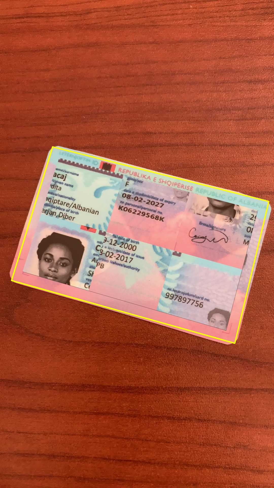
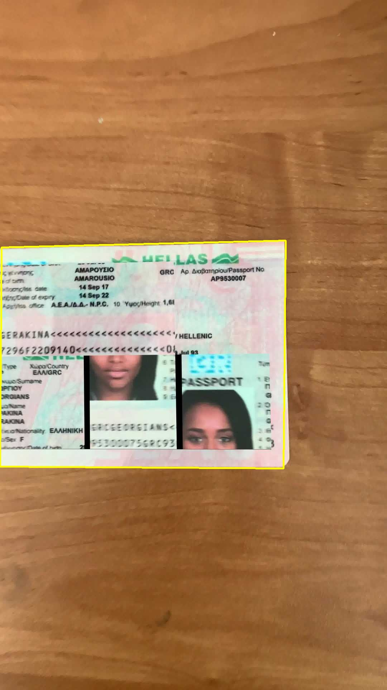
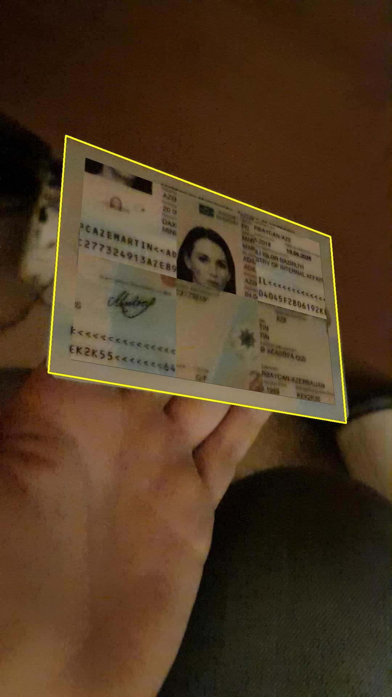
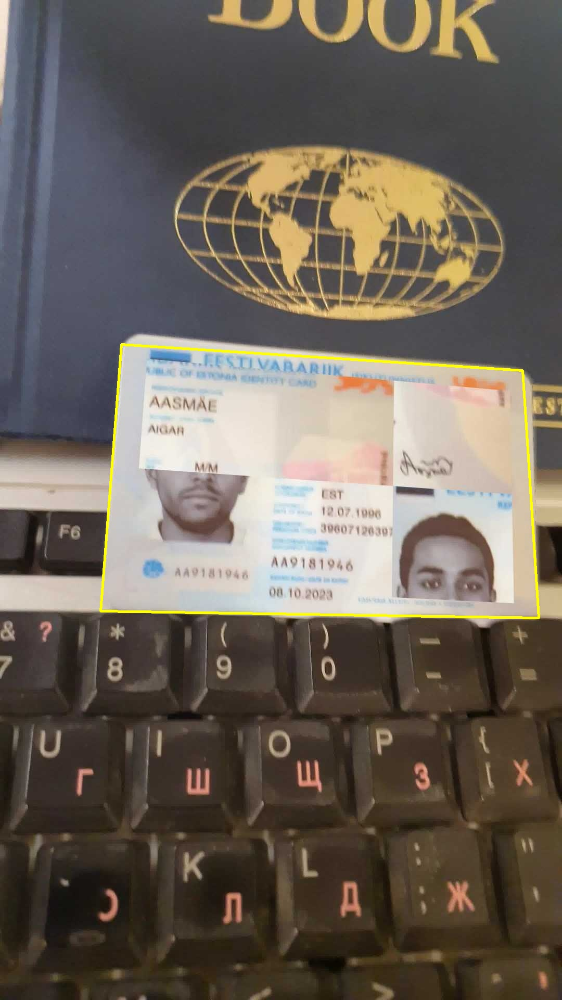

# ID Card Boundary Detection

A robust computer vision pipeline that accurately detects ID card boundaries in images using a hybrid approach combining deep learning and traditional computer vision techniques.


## 🚀 Overview

This project solves the challenging problem of precisely detecting ID card boundaries in various real-world conditions. Unlike simple bounding box detection, this pipeline extracts the exact quadrilateral boundary of ID cards, handling challenges like:

- Complex backgrounds
- Variable lighting conditions
- Perspective distortions
- Partial occlusions

## 🛠 Technical Pipeline

### Architecture Overview
```
Input Image
    ↓
YOLO Detection (Coarse Localization)
    ↓
Region Expansion (25% Margin)
    ↓
Multi-scale Processing
    ↓
GrabCut Segmentation
    ↓
Edge Detection & Contour Analysis
    ↓
Boundary Refinement
    ↓
Output with Detected Boundary
```

### Detailed Pipeline Steps

#### 1. **YOLO Object Detection**
- **Model**: Custom-trained YOLO model (`best.pt`)
- **Confidence Threshold**: 0.25
- **Purpose**: Initial coarse localization of ID card
- **Output**: Bounding box coordinates `(x1, y1, x2, y2)`

#### 2. **Region Expansion**
```python
def expand_box(x1, y1, x2, y2, W, H, margin=0.25):
    # Expands detection area to ensure complete card capture
```
- **Margin**: 25% expansion
- **Constraint**: Maintains image boundaries

#### 3. **Multi-scale Processing**
- **Target Width**: 500px for optimization
- **Scale Factor**: Dynamic based on original dimensions
- **Benefit**: Balances accuracy and computational efficiency

#### 4. **GrabCut Refinement**
```python
cv2.grabCut(crop_small, mask, grab_rect, bgModel, fgModel, 5, cv2.GC_INIT_WITH_RECT)
```
- **Iterations**: 5 refinement cycles
- **Initialization**: YOLO bounding box as foreground prior
- **Output**: Precise foreground/background segmentation mask

#### 5. **Boundary Extraction**
- **Edge Detection**: Canny algorithm (50-150 thresholds)
- **Contour Processing**: 
  - Find largest external contour
  - Polygon approximation (2% tolerance)
  - Fallback to `minAreaRect` for irregular shapes
- **Corner Ordering**: Standardized sequence (TL→TR→BR→BL)

#### 6. **Output Generation**
- **Visualization**: Yellow polygonal boundary overlay
- **File Management**: Organized output directory structure
- **Batch Support**: Process single images or entire folders

## 📁 Project Structure

```
project_root/
├── src/
│   └── detect_card_boundary.py      # Main pipeline implementation
├── models/
│   └── best.pt                   # Custom YOLO model (not included)
├── boundary_output/              # Auto-generated output directory
│   └── *processed_images*        # Results with detected boundaries
├── requirements.txt              # Dependencies
└── README.md
```

## ⚙️ Installation

1. **Clone the repository**
```bash
git clone https://github.com/yourusername/id-card-boundary-detection.git
cd id-card-boundary-detection
```

2. **Install dependencies**
```bash
pip install -r requirements.txt
```

3. **Add YOLO model**
   - Place your trained `best.pt` model in the `models/` directory

## 🚀 Usage

### Single Image Processing
```bash
python src/detect_card_boundary.py --image path/to/your/image.jpg
```

### Batch Processing
```bash
python src/detect_card_boundary.py --folder path/to/images/folder/
```

### Supported Formats
- JPEG (.jpg, .jpeg)
- PNG (.png)

## 📊 Results

The pipeline generates images with clearly marked yellow boundaries around detected ID cards, saved in the `boundary_output/` directory.

## 📊 Visual Results & Robustness

The hybrid pipeline demonstrates resilience across various real-world edge cases.

| **1. Baseline Detection** | **2. Truncation Handling** |
|:---:|:---:|
|  |  |
| *Pixel-perfect boundary on standard input* | *Robust detection even when card is partially cut off* |

| **3. Occlusion Handling** | **4. Perspective Skew** |
|:---:|:---:|
|  |  |
| *Ignores fingers using GrabCut segmentation* | *Accurate geometry on rotated/tilted cards* |

| **5. High Noise / Clutter** | **6. Low Contrast** |
|:---:|:---:|
|  |  |
| *Isolates card from messy, cluttered desk* | *Detects boundary despite poor lighting/contrast* |

## 🛠 Dependencies

```txt
opencv-python>=4.5.0
ultralytics>=8.0.0
numpy>=1.21.0
```

## ⚠️ Limitations & Honest Assessment

### Current Limitations
- **Model Dependency**: Requires custom-trained YOLO model (`best.pt`)
- **Computational Requirements**: GrabCut can be slow on high-resolution images
- **Edge Cases**: May struggle with:
  - Heavily occluded cards
  - Extremely low contrast backgrounds
  - Severely blurred images
- **Training Data Quality**: Performance heavily depends on YOLO model training

### Performance Considerations
- **Speed**: ~2-5 seconds per image (depending on resolution)
- **Accuracy**: High for clear images, moderate for challenging conditions
- **Robustness**: Good handling of moderate perspective changes

## 🔄 Alternative Approaches Considered

| Approach | Pros | Cons |
|----------|------|------|
| **Pure YOLO Segmentation** | Faster inference | Less precise boundaries |
| **Traditional CV (Hough)** | Lightweight | Too sensitive to noise |
| **Deep Learning Segmentation** | High accuracy | Heavy computation |

## 🎯 Key Features

- **✅ Hybrid Approach**: Combines deep learning precision with traditional CV robustness
- **✅ Multi-scale Processing**: Optimized for speed and accuracy
- **✅ Robust Error Handling**: Comprehensive fallback mechanisms
- **✅ Batch Processing**: Efficient handling of multiple images
- **✅ Standardized Output**: Consistent corner ordering and visualization

## 📈 Potential Improvements

1. **Performance**
   - Model quantization for faster inference
   - Parallel processing for batch operations

2. **Accuracy**
   - Perspective correction for skewed cards
   - Confidence scoring for boundary quality
   - Multi-frame consistency for video input

3. **Features**
   - OCR integration for text extraction
   - Quality assessment metrics
   - Web interface for easy usage

## 🤝 Contributing

Contributions are welcome! Please feel free to submit pull requests or open issues for bugs and feature requests.

## 📄 License

This project is licensed under the MIT License - see the LICENSE file for details.

---
